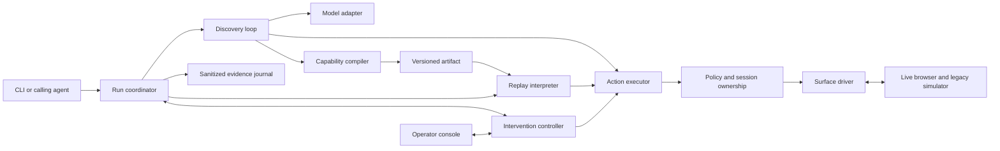

# Implementation plan

Status: implementation in progress, 2026-09-11. Checkboxes represent evidence-backed completion, not intent.

## 1. What we are building

A computer-use system that learns a task by operating a real application, saves what worked as a typed capability, and executes that capability later without a model deciding the steps.

The demonstration will use a local, fictional banking application with synthetic data. An evaluator will give a goal such as "Find this member's savings account and return its available balance." The model will inspect the live screen, choose controls, and operate the application. The resulting capability will accept a different member ID on replay and return typed data or a named business outcome. When the application presents an unresolved interruption, an operator will take control of the same browser session, resolve it, and explicitly return control.

The first delivery is this plan and a private GitHub repository. The implementation sequence below is the working checklist for subsequent development. The repository becomes public only when the owner requests that change. The assignment's submission instructions are requirements to prepare for, not authorization to email the company.

### The quality bar

Build every required part of the end-to-end chain. Make failures observable and safe. Prove important claims with executable tests and real run evidence. Keep abstractions small enough to explain during an interview. Document uncertainty instead of claiming universal safety, zero possible regressions, or unmeasured scale.

Millions of concurrent users and millions of active UI sessions are different capacity requirements. We will design for both explicitly. The assignment implementation will be a rigorously tested execution core; a deployment serving millions requires the isolation, scheduling, operational controls, and measurements in [the scale plan](docs/scale.md). Those are release prerequisites for that deployment, not capabilities the local submission can claim.

## 2. Scope and acceptance map

| Assignment requirement | Concrete implementation | Proof required before completion |
| --- | --- | --- |
| 3.1 Goal-driven loop | Goal, target binding, named runtime inputs, screenshot/control observation, bounded model decisions, real UI actions | Genuine provider-backed discovery against the running simulator; no predefined action sequence supplied to the model |
| 3.2 Capability artifact | Strict versioned JSON with inputs, outputs, targets, ordered steps, preconditions, postconditions, outcomes, recovery rules, provenance | Schema rejection tests, reviewable saved artifact, replay using different inputs |
| 3.3 Deterministic replay | Model-free interpreter, stable targeting, bounded waits, explicit outcome taxonomy, verified output extraction | Replay with provider access disabled; business, recovery, and hard-failure tests |
| 3.4 Guardrails | Trusted application policy, action classification, origin/route/method checks, restricted commands, sensitive-data handling | Denied actions never dispatch; adversarial egress and secret-canary tests |
| 3.5 Evidence | Typed event journal plus sanitized structural failure snapshot; optional safely masked screenshot | Discovery and replay logs, debuggable failure bundle, no sensitive canaries in persisted data |
| 3.6 Human handoff | Intervention inbox, exclusive control ownership, manual actions in the same session, guarded resume | Real operator exercise and deterministic race tests; human events retain session identity |
| 3.7 Heterogeneity and scale | Driver boundary, application bindings, immutable capability revision, tenant specialization design | Legacy iframe/table demonstration; written desktop, isolation, reuse, drift, and capacity design |
| Required deliverables | README, REPORT with seven exact headings, evidence directory | Clean-checkout walkthrough and release audit |

The full test mapping is in [verification](docs/verification.md). The short evaluator narrative is in [REPORT.md](REPORT.md). The implementation contract is in [design](docs/design.md).

## 3. Demonstration use cases

### Primary capability: read a savings balance

1. Open the simulator's member search screen.
2. Enter a supplied synthetic member ID.
3. Submit the search and inspect its result.
4. Open the matching member, then their savings account.
5. Check that the displayed account belongs to the requested member and has the requested account type.
6. Read available balance and currency from the UI, parse them deterministically, and return them to the caller.

Inputs: `memberId`, a constrained string. Outputs: `availableBalanceMinor`, an integer in currency minor units; `currency`, an enum initially restricted to USD; `accountType`, the literal `savings`. Member identity is checked in memory and is not echoed into persistent evidence. The same capability must work for two IDs with different balances. An absent member and a member without a savings account are separate legitimate outcomes.

### Secondary capability: prepare a sub-account for review

Search for a member, open the new sub-account form, fill account type and nickname, and reach the review screen. Verify the review matches the inputs. Stop before the final "Open account" action. This exercises parameterized forms, validation errors, a review checkpoint, and a concrete irreversible boundary. It is part of the core demonstration suite, built after the primary path passes.

### Handoff case

A replay encounters an unexpected application interstitial requiring an operator acknowledgment. The run pauses. The operator claims the intervention, sees the live session, dismisses the interstitial through the operator controls, and returns control. The engine checks its declared resume condition before continuing. A separate session-expiry scenario demonstrates that authentication recovery cannot silently skip previously required steps.

### Runtime scenarios

The simulator will support normal behavior, member absent, account absent, validation rejected, permission denied, known dismissible notice, unexpected modal, session expired, bounded slow load, persistent application error, duplicate matching controls, changed frame/control binding, and a click whose visible completion is delayed. Fault selection belongs to the test/demo harness, never to model observations or automation decision logic.

The target is deliberately legacy-like: server-rendered forms, an iframe workspace, nested tables, no test IDs, some controls with adjacent text instead of associated labels, and regenerated element IDs. It must remain usable by a person. Success must come from UI interaction; discovery and replay may not call fixture data/reset/fault endpoints or read application source, hidden state, or database contents.

## 4. Chosen stack

| Choice | Specific job and reason |
| --- | --- |
| TypeScript, strict mode | One language for contracts, browser integration, CLI, and the small operator client; discriminated unions make invalid action/result combinations visible during development |
| Node.js 24 LTS | Supported runtime for Playwright and the provider SDK, native cancellation/HTTP/test facilities, straightforward macOS and Linux setup |
| Yarn 4 | Lockfile-based reproducibility and alignment with workspace tooling; use `node-modules` linking for predictable browser tooling |
| Playwright with pinned Chromium | Real input, frame-aware locators, actionability checks, browser lifecycle, dialogs, and screenshots in one maintained dependency |
| Zod 4 | Validate untrusted artifact, model, and operator inputs; derive TypeScript types and export the supported JSON Schema representation from one source |
| OpenAI Responses API and official SDK | One discovery-only model adapter, strict structured decisions, image observations, bounded requests and usage evidence |
| `gpt-6-astra` discovery model, `reasoning.effort` starting at `low` | Owner's selection. Documented image input, structured outputs and computer-use capability. No dated snapshot exists yet, so every discovery run records the exact model string, response IDs and token usage in provenance and evidence; the effort level is raised only if the live task measurably needs it |
| Native Node HTTP and plain HTML/CSS/TypeScript | The simulator and a small local operator console need forms and a few typed endpoints; no application framework, SPA state library, database, or frontend build system is justified yet |
| Node test runner and Playwright Test | Public contract/state-machine tests plus real-browser integration and operator-flow tests; each covers a different boundary |
| JSON artifacts and JSONL evidence | Human-reviewable files and simple local operation; atomic artifact writes and serialized bounded evidence writes |
| Docker Compose containment profile | Reproducible Linux/browser environment and an internal browser/target network for the isolation tests; native setup remains available for the trusted local fixture |

Production quality comes from correct boundaries and verification, not a long dependency list. [Decisions and primary sources](docs/decisions.md) explain alternatives, limitations, and the evidence needed to keep these choices. Exact package versions and container digests are selected and locked during bootstrap after compatibility and security checks. No floating `latest` versions in the runnable submission.

## 5. Architecture at a glance



The replay interpreter cannot import the model adapter. Every automation or operator command goes through the same policy and ownership boundary. A browser session has exactly one owner at a time. The application binding owns knowledge of controls, allowed effects, and error markers; it does not prescribe the workflow order. The model discovers that order through observations.

Proposed source layout, to be created only as each component is implemented:

```text
src/contracts/       Artifact, decision, result, event and intervention schemas
src/core/            Replay, action execution, policy, ownership and artifact compiler
src/discovery/       Observe/decide/act orchestration and provider adapter
src/surfaces/        Surface interface and Playwright implementation
src/applications/    Legacy simulator binding and trusted policy
src/evidence/        Event serialization, sanitization and atomic file storage
src/operator/        Local intervention API and small operator client
src/cli/             Arguments, lifecycle, output and exit codes
demo/                Fictional banking UI, synthetic fixtures and fault harness
tests/               Contract, integration, browser and adversarial tests
evidence/            Reviewed genuine discovery/replay/handoff examples
docs/                Detailed design, decisions, verification and scaling
```

## 6. Implementation sequence and commit gates

Every implementation commit contains the tests needed for the behavior it introduces. Do not commit a failing intermediate refactor and promise to fix it in the next commit. Keep the last passing path runnable. If a check fails, repair the change or reduce its scope before committing. Tests reduce regression risk; they cannot prove that no possible regression exists.

| Stage | Intended commit subject | Work and exit gate |
| --- | --- | --- |
| P0 | `docs: define implementation plan and acceptance criteria` | Read the full assignment, research key decisions, write this baseline, check links/headings, create private repository |
| P1 | `chore: establish reproducible tooling and quality checks` | Pin runtime/packages/browser, strict TypeScript, lint/format, test scripts, CI, safe ignore rules and doctor command; clean install and all available checks pass |
| P2 | `feat: define capability and execution contracts` | Implement v1 schemas, bounded parsing, semantic validation, result taxonomy, event formats and handoff transitions; malformed references, incompatible versions and invalid state transitions fail safely |
| P3 | `feat: add legacy banking simulator and scenario harness` | Primary UI, review flow and fault scenarios with synthetic data; a person and a browser test can complete both flows; simulator state never enters the runtime through a shortcut |
| P4 | `feat: add policy-checked browser sessions` | Observe/resolve/act, legacy targeting, ownership gate, redacted observations, request controls, sanitized failure snapshots and lifecycle cleanup; real browser and policy tests pass |
| P5 | `feat: replay capabilities with verified outcomes` | Model-free interpreter, postconditions, extraction, business outcomes, bounded recovery and typed failures; a clearly labeled test artifact replays for different inputs without model access |
| P6 | `feat: discover and compile reusable UI capabilities` | Genuine structured model decisions, budgets, param references, compiler and provenance; at least one actual successful model run compiles and replays before moving on |
| P7 | `feat: add exclusive live-session operator handoff` | Intervention inbox, authenticated local commands, same-session human input, event capture and verified resume; race, stale-control and manual exercise pass |
| P8 | `feat: demonstrate review workflows and runtime recovery` | Complete secondary capability, entire scenario matrix and read-only repeated stability exercise; no blind retry or premature success |
| P9 | `test: verify containment and failure boundaries` | Container isolation profile, cross-origin probes, prompt injection, sensitive-data canaries, cancellation, crash and resource tests; document verified platform limits |
| P10 | `docs: publish reproducible discovery and replay evidence` | Capture final-commit discovery/replay/exception/handoff evidence; finish README and 1-3 page REPORT; independent clean checkout and all release gates pass |

Stage order is dependency-driven. If early research or the P4/P6 experiments invalidate a design choice, add a narrow decision entry and fix the earlier stage before extending the system. Do not disguise a scripted run as discovery to get past P6. Provider credentials are a prerequisite for that stage, not for planning or deterministic development.

### Progress ledger

- [x] Read all ten assignment pages and verify the document layout.
- [x] Map every core requirement and required deliverable.
- [x] Research browser semantics, model contracts, data handling, runtime and isolation choices.
- [x] Write the architecture, test strategy, threat model and capacity design.
- [x] P0: Verify the planning baseline and establish the private repository at `Darksp33d/computer-use-automation`.
- [x] P1: Reproducible tooling. Immutable Yarn install, TypeScript checks, formatter/linter, doctor tests and pinned Chromium setup passed locally. CI is configured; remote execution is verified separately.
- [x] P2: Contracts and state machine. Twelve unit tests pass, including invalid artifacts, typed parameters, money parsing and ownership races. Generated schema consistency passes.
- [x] P3: Simulator and scenarios. Three real Chromium flow tests and a visual inspection pass. Fault fixtures are available for the runtime suite; no account commit occurs in the tested flows.
- [x] P4: Policy and surface driver. Seventeen unit tests and six browser tests pass. The driver resolves legacy controls without generated IDs, rejects ambiguous targets and frame drift, and journals only allowlisted event fields. Broader adversarial containment checks remain in P9.
- [ ] P5: Deterministic replay.
- [ ] P6: Genuine discovery and compiler.
- [ ] P7: Live-session handoff.
- [ ] P8: Complete flows and runtime recovery.
- [ ] P9: Adversarial and containment verification.
- [ ] P10: Submission-quality evidence and walkthrough.

## 7. The evaluator experience

The following is the intended command contract, not currently available software. README will contain only verified commands once implementation exists.

```bash
corepack enable
yarn install --immutable
yarn setup
yarn doctor
yarn demo
```

`yarn demo` will start the local target and operator console, replay the included genuine capability, show typed output, exercise a not-found result, then offer the handoff scenario. It will require no model key, Docker, bank credentials, or cloud services after dependencies and Chromium are installed. It will label this path as replay of a saved discovery artifact. It will print useful local URLs and stop owned processes cleanly on exit.

To perform a fresh discovery, the documented sequence will be:

```bash
yarn target
# In a second terminal, with OPENAI_API_KEY configured privately:
yarn cua discover --target legacy-bank --goal "Read the savings balance for the supplied member" --inputs demo/inputs/member-a.json --out .local/capabilities/savings.json
yarn cua replay --artifact .local/capabilities/savings.json --target legacy-bank --inputs demo/inputs/member-b.json
```

The input files will contain synthetic values only. For real confidential inputs in future deployments, use authenticated request bodies or private files/stdin, not shell arguments. `discover` will require the registered target's reviewed task contract, resolved from the selected demo workflow or an explicit contract file; it will never obtain success by matching the goal to a hardcoded action sequence. The basic savings demo is the default registered contract. The secondary workflow selects its separate contract explicitly.

Machine output goes to stdout as one typed JSON result. Progress goes to stderr. Default presentation suppresses sensitive output values; an explicit result-output option can return them to an authorized caller without adding them to logs. Synthetic demo values are clearly labeled and can be displayed. Planned exit codes: 0 success, 2 known business outcome, 3 failure, 4 canceled; a run awaiting intervention remains live and exposes its current state.

## 8. Decisions that must survive scrutiny

- A model's claim of completion is not proof. The declared checkpoint, subject identity and output schema must agree with the live UI.
- A capability's declared risk cannot grant permission. Trusted application policy classifies effects independently.
- Strict JSON does not make a model decision safe. Validate its target reference, action, inputs, current observation, budget and authority before dispatch.
- Locator ambiguity is a failure, not a reason to choose the first match. No unreviewed fallback or visual guess in replay.
- A timeout after an action has been dispatched creates uncertainty. Re-observe before any repeat; never automatically repeat an irreversible action.
- Human takeover transfers control, not unrestricted permission. Resume requires a checkpoint and a new ownership generation.
- An observed successful path does not establish all error branches. The reviewed application binding supplies error classifiers; the scenario suite validates them.
- Redaction applies before model transmission and before persistence, including screenshots, goal text, selectors, exceptions and operator inputs.
- A file digest proves content identity, not provenance authenticity. Production approval and signing need independently protected authority.
- A local browser context is useful session separation, not a hostile-tenant security boundary.

## 9. Remaining uncertainties and stop conditions

| Question | Resolution gate | Response if it fails |
| --- | --- | --- |
| Can the observation/targeting strategy handle unlabeled controls inside the actual legacy fixture? | P4 browser contract tests with regenerated IDs and duplicate labels | Refine the scoped relation binding; do not claim generic visual replay |
| Is `gpt-6-astra` available to the owner's account and successful with the strict decision schema at the chosen effort level? | P6 provider smoke run and actual discovery | Verify account tier and access; raise effort or evaluate an explicitly documented replacement with the owner; never substitute a fake run |
| Can the compiled path run with different input values? | P6 fresh-session replay | Reject the artifact and repair parameterization or targeting |
| Can manual events be mediated and resumed without a race? | P7 concurrent claim/resume/action tests | Keep session paused; simplify the console/controller before proceeding |
| Are failure snapshots useful without leaking data? | P4/P9 sensitive canaries and human inspection | Prefer a structural snapshot with allowlisted labels; omit unsafe screenshots |
| Do network controls block actual prohibited traffic? | P9 external receiver tests in native and contained modes | Remove any unsupported claim; require the contained profile for that boundary |
| What throughput and success rate can the system sustain? | P8/P9 measured local suite, future deployment load tests | Publish raw measurements and limits; no extrapolation presented as a benchmark |

## 10. Definition of done

Completion requires every acceptance row to have passing evidence, not simply a matching source file. At minimum: two parameterized workflows; one genuine provider-backed discovery; replay with the provider inaccessible; all runtime scenario classes; one real same-session operator exercise; sanitized richer failure evidence; tested policy denial; clean install and shutdown; required report headings; and an organized commit history.

Final review must reconcile documentation with implementation, list remaining limitations plainly, verify that all examples are reproducible from the pinned revision, and inspect the entire tracked tree for secrets, private paths, unsupported claims and em dash characters. External publication and submission remain explicit owner actions.
