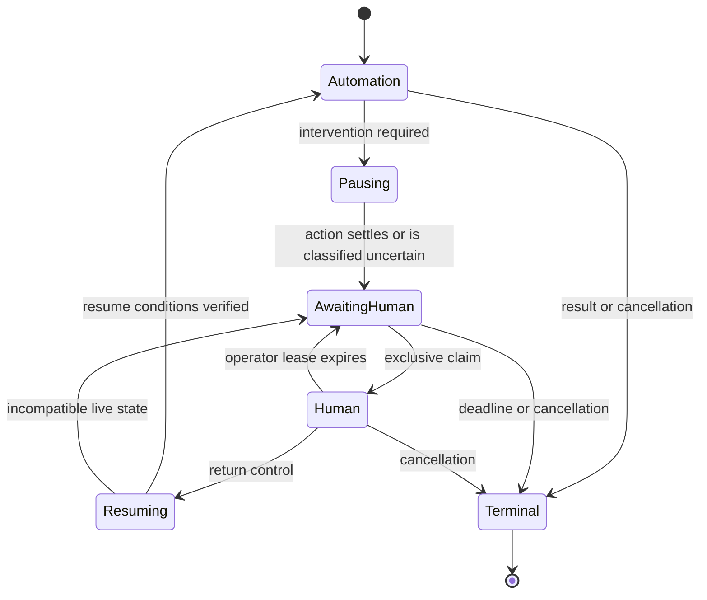

# Design contract

Status: verified implementation contract. Both live discovery workflows, the React console, review catalog, same-session handoff, fault scenarios and local containment are implemented. [Final evidence](../evidence/README.md) links the source, runs and recording. PLAN.md records the passed gates. Deployment extensions are identified explicitly.

## 1. Trust boundaries and module responsibilities

The calling agent supplies intent and runtime arguments. The model suggests the next UI action. Neither controls the policy, the interpreter, the artifact approval decision, or the operator's authority. The UI, model responses, artifact files and operator requests are untrusted inputs.

The run coordinator owns cancellation, run identity, deadlines, session lifetime and terminal results. The discovery loop consumes observations and a decision provider. The replay interpreter consumes a validated capability and a surface interface. Both use one action executor. That executor checks ownership, policy, current target identity and action preconditions before performing an action.

The compiler converts executed discovery events into a draft capability. It cannot invent unexecuted successful steps. A reviewed application binding supplies permitted origins, known control identities, risk classifications, error markers and input/output semantics. It may teach the engine what a control means; it may not embed a complete action sequence that masquerades as model discovery.

The simulator and scenario harness are separate from the runtime. Tests may inspect fixture state as an independent oracle, but discovery and replay may only observe the UI. Browser-generated requests are allowed; direct backend integration by the automation is excluded.

## 2. Capability v1

Use a strict JSON-compatible schema with a deliberately small expression language. Reject unknown keys, unsupported schema versions, oversized files, excessive steps, duplicate IDs and invalid references before creating a browser. JSON Schema export and runtime validation come from the same Zod definitions. Add semantic validation for relationships a structural schema cannot express.

| Field | Contract |
| --- | --- |
| `schemaVersion` | Exact supported integer, initially `1`; never silently reinterpret an unknown version |
| `id`, `revision`, `description` | Stable capability name, immutable revision, reviewed description with no runtime values |
| `application` | Exact supported family, driver identifier and binding version; no tenant hostname or credentials |
| `inputs` | Named, required constrained string/enum/integer/boolean definitions; no coercion; sensitivity classification and intended use |
| `outputs` | Named typed definitions, sensitivity, deterministic parsing rule and source target |
| `targets` | Logical control references with frame scope, target strategy and rationale; the driver requires exactly one match before acting |
| `entry` | Registered route reference and a verifiable initial condition |
| `steps` | Ordered steps with IDs, supported action, target/input/output references, preconditions, postconditions and effect classification |
| `outcomes` | Named business outcomes and detection conditions, checked wherever the recognized state occurs |
| `recovery` | Explicit known-condition handlers, exact allowed actions, bounded attempts and return checkpoint; no general scripting or arbitrary jumps |
| `success` | Conditions binding the requested subject, reached screen and declared output sources |
| `provenance` | Discovery or fixture kind, discovery run ID, actual model, prompt version, browser version and source revision; no raw transcript |

A separate local registry entry pins the artifact's byte digest and binding digest and records a reviewed/approved revision. It is separate because an artifact must not approve itself. Hand-authored development fixtures are named and documented as fixtures; real evidence contains only genuinely discovered artifacts. A deliberate review and successful fresh replay are prerequisites to promote an artifact. The console records the local operator; bundled development revisions separately identify an engineering review and are not evidence of a human exercise. Editing any content creates a new revision and invalidates its prior approval.

The initial schema implements only the browser strategies we actually execute. Future desktop strategies require a new explicit schema extension and driver support check. A generic `kind: string` escape hatch would weaken validation and is excluded.

### Values and parameters

Fill and select actions accept named input references. Read actions name a declared output. Click actions name a registered target. There is no interpolation, JavaScript, arbitrary selector, output chaining or executable template. Conditions are bounded conjunctions of visible, absent, equalsInput and equalsLiteral checks. The reviewed binding supplies safe labels and literal conditions; invocation data stays in memory.

Example of the implemented step shape:

```json
{
  "id": "fill-member-id",
  "action": { "kind": "fill", "target": "member-field", "input": "memberId" },
  "preconditions": [{ "kind": "visible", "target": "search-screen" }],
  "postconditions": [{ "kind": "equalsInput", "target": "member-field", "input": "memberId" }],
  "effect": "reversible"
}
```

Entry navigation is registered as `search`. Known recovery can click one reviewed control once and verify its postconditions. The schema deliberately omits unused navigation actions, nested boolean expressions and output chaining (D10). Reads reject malformed grouping, unsupported currency, overflow and non-finite numbers. Money is integer minor units. Determinism describes execution rules; external values may change between runs.

## 3. Observation and targeting

The browser driver returns an observation generation, recognized screen, registered controls with match counts and visibility/enabled flags, condition results and classified state. Frame scope comes from the reviewed targets. A separate screenshot method returns masked pixels where safe. The model sees this bounded observation, the goal, the task contract and named input references. It cannot inspect hidden DOM attributes for data, execute JavaScript, access the filesystem or call the simulator's backend.

Discovery decisions select a control reference from the current observation. Immediately before dispatch the executor re-observes and the driver resolves that control again. A stale generation or failed identity checkpoint prevents dispatch.

Target strategies, in order of preference:

1. Exact accessible role and name inside an explicit, unique frame/screen scope.
2. Exact visible text or associated field label in that scope.
3. A reviewed relation in legacy markup, such as the input in the same form row as the exact visible "Member number" caption. Frame identity, row identity and control cardinality must all agree.

Prefer stable user-visible meaning over generated IDs, broad CSS paths and element indexes. Each target has one reviewed strategy; the journal's target reference links to it in the artifact. There are no fallback selectors, `.first()`, force clicks or fuzzy matching. Zero matches wait within the deadline or fail. Multiple matches fail as `TARGET_AMBIGUOUS` before any input.

Screenshots help discovery understand a poorly labeled screen. We are not claiming image-only deterministic replay in v1. If a control cannot be grounded into a supported stable strategy, discovery pauses for intervention or rejects the capability. A native desktop driver could implement accessibility identity and verified visual anchors later, but it must satisfy the same resolution and ambiguity contract.

## 4. Discovery and compilation

1. Resolve the registered target and reviewed task contract. Validate input types and policy compatibility. Launch a fresh owned session.
2. Observe the live UI. Replace sensitive input values and matching displayed data with reference labels in model-bound text; mask the corresponding image regions. If masking coverage is unknown, omit the image and use the safe structured view.
3. Ask the provider for one strict decision: act with a typed action and named references, finish, or declare the goal unsupported. Do not request or persist private reasoning traces. The runtime supplies bounded journal reason codes and the console renders vetted event labels.
4. Classify provider refusal as `MODEL_REFUSED`, incomplete or malformed responses as `MODEL_INVALID`, and transport/rate-limit failures as `MODEL_UNAVAILABLE`. Active-budget expiry and caller cancellation remain distinct. Do not repair parsing or retry the request; no UI action is dispatched until a valid decision is accepted.
5. Pass the decision to the shared executor and observe its outcome. Journal provider response metadata, the authorized action intent and the actual completion or failure in sequence.
6. Stop on verified completion, cancellation, budget exhaustion, no-progress detection, policy denial or a state requiring intervention. A model `finish` request is advisory until the task contract's conditions pass.
7. Compile only a successful executed path. Resolve observation references into stable target descriptors and parameter bindings. Keep the raw journal separate. A recovery detour must be represented by an explicit tested handler or rejected as unsuitable for publication; do not silently delete history to create a cleaner-looking flow.
8. Validate structure, semantics and binding policy, then write the reference-based draft atomically. Replay it in a fresh session with different synthetic inputs and verify its output parsers and success conditions. Automated tests additionally compare outputs with independent fixture expectations and scan persisted evidence for sensitive canaries. Promote only after review and passing replay validation.

Implemented P6 limits are 30 model decisions, 180 seconds active discovery, 30 seconds per provider request, 2,000 output tokens per request, 24 KB of structured observation and a 1 MB masked low-detail image. Aggregate reported tokens are limited to 120,000. Repeating the same action on the same screen stops as `NO_PROGRESS`. SDK retries are disabled: a provider failure ends this discovery attempt without replaying a UI action.

The OpenAI adapter admits a request only if a conservative $0.50 reservation fits within its $2 estimated run budget. A completed response reconciles this against reported tokens at the researched standard rates ($10 input and $50 output per million, 2026-09-11). A failed or timed-out call retains the reservation. Each pending request is also canceled when the remaining active execution budget expires; user cancellation is reported separately. Refusal, invalid responses and transport failure have distinct safe classifications. This is application admission accounting, not a provider billing guarantee; account-level spending controls remain separate. Standard service tier is explicit. [Published pricing](https://openai.com/index/gpt-6-astra/).

SDK retries are disabled to avoid multiplying retry layers. Cancellation stops new commands and aborts model requests; it cannot undo a UI effect already sent. Both final genuine discoveries completed within the configured budgets.

## 5. Replay and result semantics

Replay resolves a reviewed artifact revision plus a registered application binding and validated inputs. It checks compatibility and effective policy before opening a session. It has no provider instance, key requirement, or model fallback.

At each step: check ownership and cancellation; classify current state; evaluate preconditions; uniquely resolve the target; authorize the exact action and its effect; dispatch once; wait for a declared postcondition or a classified competing state; record the result. Business outcomes and safety blockers take precedence over success if both appear. Conflicting state markers fail explicitly instead of being arbitrarily ordered.

| Result | Meaning | Example |
| --- | --- | --- |
| `success` | Final checkpoint and output validation passed | Savings balance returned for the requested member |
| `business_outcome` | Valid known response with a typed code | `MEMBER_NOT_FOUND`, `ACCOUNT_NOT_FOUND`, `VALIDATION_REJECTED` |
| `failure` | A technical, policy or unresolved execution condition stopped the run | `PERMISSION_DENIED`, `TARGET_AMBIGUOUS`, `APP_UNAVAILABLE`, `UNSUPPORTED_BINDING`, `POLICY_DENIED`, `UNCERTAIN_EFFECT` |
| `canceled` | Caller or operator terminated the run | No new commands; any already dispatched effect is reported |

`awaiting_human` is a nonterminal ownership state, not a successful final result. A failed intervention deadline becomes a typed failure. Business outcomes carry a run ID and code without partial success output. Failures carry the run ID, code, step ID, effect state (`not_dispatched`, `confirmed`, `unknown`) and structural expected/observed diagnostics. The step ID links to the action in the artifact and journal; the run ID identifies its evidence directory. Never serialize a raw Playwright/provider error message directly.

### Recovery rules

- Slow load: wait for the declared condition within one bounded deadline. Do not use a fixed sleep as proof that a screen is ready.
- Known notice: run a reviewed dismiss action once, verify the notice is gone and the interrupted step's precondition holds.
- Missing member or account: return a business outcome immediately.
- Validation rejection: return the declared outcome; never invent different business input to make the form pass.
- Permission denied: pause or fail, with no privilege escalation or alternate account search.
- Session expiry: pause for operator intervention. Resume only when the current checkpoint and subject identity are restored. Returning to an incompatible entry screen does not restart the capability; verification leaves it paused.
- Unexpected modal or unknown screen: pause with safe evidence. Unknown browser-native dialogs remain pending under the same session and are exposed as an intervention; no blanket auto-accept handler.
- Timeout after click: inspect the postcondition and known outcomes without repeating the action. A verified postcondition confirms completion; an unresolved checkpoint stops or requests intervention while preserving the unknown effect state.
- Process or browser crash: report interruption from the persisted safe journal if available; do not recreate a session and claim it is the original live session.

Exactly-once execution of arbitrary legacy UI side effects is not a guarantee the system can provide. A durable job ID can deduplicate job admission; it cannot prove whether a bank screen committed a transaction before losing its response.

## 6. Policy and data handling

The trusted origin and reviewed binding define permitted requests, controls and effects. The capability supplies a validated sequence within that authority; it has no separate permissions field. Risk classification comes from the binding's known control/effect map, never from model wording or button-text heuristics alone. Unknown controls/effects are denied. Tenant-specific policy intersection belongs to the deployment design.

Allowlist the exact origin, registered paths, HTTP methods and UI actions. Reject query strings, fragments, URL userinfo, unregistered schemes, unregistered ports and unapproved navigation. Check before action and at the browser request boundary, including frames, resource loads, forms, redirects, popups and downloads. Service workers are blocked. WebSockets, downloads and file selection are denied. A route check after navigation is detection, not prevention.

The initial target requires no redirects. Its intercepted requests use bounded fetching with automatic redirects and retries disabled; redirect responses fail closed. The actual request receiver tests must prove this behavior on the pinned browser. Arbitrary target support is disabled. Native browser hooks remain application guardrails, not complete network isolation. The container profile and future tenant worker boundary restrict egress independently; see [verification](verification.md) and [scale](scale.md).

The final account-opening action is blocked in v1 for automation and mediated operators. A person cannot approve a forbidden action by setting `confirmed: true`. The review page is the capability's terminal boundary. Production write capabilities would require reviewed effect semantics, transaction-specific authorization and reconciliation before expanding this policy.

Persist schema-approved event fields only. Safe identifiers and allowlisted static labels describe what happened; sensitive inputs, output values, goals, DOM text, prompt contents, cookies, storage state, request bodies, credentials and raw screenshots do not enter logs. Do not hash low-entropy member IDs as a supposed anonymization method. Keep runtime values out of persisted evidence. Release the active session after completion. The authenticated console retains output in its bounded in-memory run history until eviction or shutdown. A sanitization failure stops evidence export rather than falling back to raw data.

Execution failures persist a structural snapshot with run and step IDs, ownership and the last observation: recognized screen, registered control IDs/types, visible/enabled flags, match counts, condition evaluations and classified state. Startup failures explicitly report that no observation is available. Unknown strings are omitted. Screenshots are optional and use native opaque pixel masks before leaving the process. An application-owned allowlist covers visible text outside masked regions. Unknown text, unexpected frames, image/canvas/video content, backgrounds or generated text causes image omission; a missing image policy also defaults to omission. This targets the supported banking UI and is not a general redactor for arbitrary rendered content. Screenshot-only CSS was rejected after a canary experiment showed that the target CSP could block it. Masks can obscure overlapping notice content; the authenticated inspector supplies the registered intervention reason and permitted controls. Full traces and videos are disabled by default because they can contain sensitive page/network data. Synthetic evidence is exported explicitly after scanning and visual review.

Use `store: false` for provider requests, but do not equate that setting with zero provider retention. Production financial data needs approved provider controls and data policy; the submission sends synthetic data only.

## 7. Human control transfer



Each session owns a control state containing `owner`, monotonically increasing `epoch` and `actor`. The session and its journal provide the run ID; ownership does not duplicate it. The controller serializes UI commands and ownership transitions. These operations carry the expected epoch and are checked again at dispatch, so queued stale commands cannot act after a transfer. Cancellation separately aborts the session.

Pausing rejects new automation commands and resolves the in-flight action's known/unknown status before granting human control. A second claimant receives a conflict. A stale automation response or stale operator tab cannot act after an ownership change. Lease expiry pauses the session; it does not silently return control to automation.

A timeout wrapper alone is not cancellation: the underlying browser command must settle or be stopped before another owner may issue input. If command quiescence cannot be established, retain a blocked session or terminate it with a failure. Application-side asynchronous effects can still complete after the input command settles; show that uncertainty to the operator and require re-observation before any conflicting action.

The console is a small loopback service with an intervention list, safe reason/current-step view, live screenshot or structural view, claim, click/type/select controls, dialog controls, return-control and cancel. Its commands drive the existing browser/page object through the executor. It never opens a replacement browser session. Human actions are individually recorded with actor, epoch and action. Workflow controls also carry the target and current step ID; native-dialog dismissal has no DOM target. Input values are omitted. These events remain a separate manual segment and do not silently alter the saved capability.

The controller binds to loopback, validates Host and Origin, restricts request sizes and rejects stale command generations. A random bearer credential lasts for this controller process and authorizes its local workspace. The launch fragment is removed immediately and held in browser memory; refresh requires the launch link again, and restarting the controller replaces the credential. Human control leases expire independently. Credentials never enter query logs or persisted evidence; API requests use an authorization header. The target application never receives the operator credential or the model key. Provider and operator routes are outside the target's allowed browser origins.

The normal manual path uses mediated console commands so authority and action evidence are enforceable. Direct DevTools or unmanaged browser input is outside this guarantee and is disabled in the default flow. The local operator name is attribution on a trusted workstation, not enterprise identity proof. Production requires authenticated operator identities and per-tenant authorization.

Resume runs in the same serialized queue as actions. It waits for earlier accepted commands, re-observes and verifies the current checkpoint, then increments the epoch and transfers ownership to automation on success or leaves it awaiting a human on failure. Later commands carrying the old epoch are rejected. A human "done" click never marks the goal successful by itself. Polls and commands are bounded; a ten-minute initial intervention TTL prevents orphaned sessions, with explicit remaining-time display.

## 8. Persistence and lifecycle

Artifacts are immutable after promotion. Write and flush a temporary file in the destination directory, then publish it through a hard link that cannot replace an existing revision. Delete the temporary name afterward. Serialize bounded journal events with sequence numbers; disk write failures are surfaced. Enforce per-run event and byte limits. Persist action intent before dispatch and outcome afterward; if audit persistence is unavailable, stop new actions. A crash between these records means the effect may be unknown.

The local runner supports one active session per invocation and bounded independent invocations. Each gets a separate browser process/context, credentials, output directory and lifecycle. Ownership is in-process; it is not a distributed lease. The journal records run start and terminal result without browser state or inputs. A journal without a terminal event is incomplete; it does not establish success or distinguish a still-running process from a crash. There is no automatic session recovery after process loss.

Cancellation also reaches the fresh replay used to validate a discovery; a canceled validation cannot be approved. A late screenshot poll cannot replace the final retained image after execution ends.

On cancellation, stop admitting session commands, settle or classify the in-flight operation, close the browser, end session ownership, drain safe journal writes and stop the owned target. The controller credential remains usable for other sessions until controller shutdown. Terminate only processes created by this run. Normal runtime files live in ignored `.local/`; submission evidence is a deliberate reviewed export. Individual journals are bounded to 2,000 events and 1 MiB. Total on-disk retention is manual in this local edition; automatic age/size retention and protected archival are production prerequisites. Filesystem deletion is not a cryptographic erasure guarantee.

## Public discovery invocation

`DiscoveryIntent` carries a caller's public English goal and the registered `northstar` target. The console requires these fields in discovery mode; `discover --request` accepts them with the workflow contract and typed arguments over bounded JSON stdin. The member-search entry point comes from the reviewed binding. Only a supported contract is executable, and unsupported goals yield `GOAL_UNSUPPORTED`. The SDK request contains the prepared caller goal; neither compiled capabilities nor journals copy it. Sensitive argument values are replaced with references before transmission, with narrow input-shape rejection as documented in README. This does not authorize arbitrary private text or arbitrary URLs.

Failure results carry structural expected/observed diagnostics with no raw value: expected conditions and output parser/allowlist, observed screen/state and condition satisfaction. Startup failures have no invented observation. Operator and CLI consumers receive the same diagnosis; the runtime persists it alongside the step and effect state.
